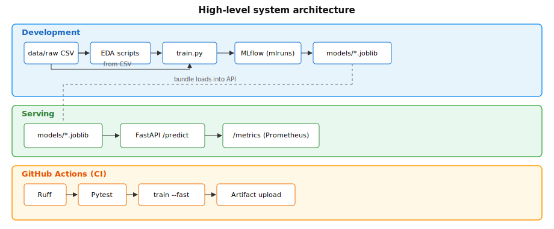
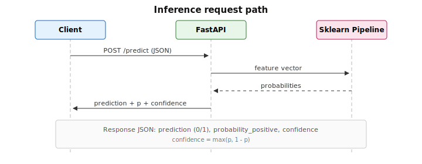

## 1. Executive summary

This project trains a **binary classifier** for heart-disease risk on the **Cleveland processed** subset from the UCI Heart Disease repository. Implementation covers: **sklearn `Pipeline`** preprocessing and training with **MLflow** logging, **GitHub Actions** (Ruff, pytest, train, artefact upload), a **FastAPI** service exposing **`/predict`**, **Docker/Podman** images, **Kubernetes** manifests (`k8s/`), and **Prometheus** metrics plus structured request logging.

Models compared are **logistic regression** and **random forest** inside a single CV protocol; the better hold-out **ROC-AUC** model is saved as `models/heart_classifier.joblib` and loaded by the API.

---

## 2. Setup and installation

### 2.1 Prerequisites

| Component | Version / notes |
|-----------|-----------------|
| Python | 3.10+ (CI uses 3.11) |
| OS | macOS, Linux, or WSL |
| Optional | Docker or Podman, `kubectl`, local cluster (Minikube with Colima/docker driver, Kind, or Docker Desktop Kubernetes) |

### 2.2 Clone and virtual environment

From the **repository root** (`heart-disease-mlops/`):

```bash
python3 -m venv .venv
source .venv/bin/activate    # Windows: .venv\Scripts\activate
pip install --upgrade pip
pip install -r requirements-dev.txt
pip install -e .
```

### 2.3 Verify installation

```bash
ruff check src tests
pytest tests/ -v
```

### 2.4 Train the model

```bash
python -m heart_mlops.train              # 5-fold CV (slower)
python -m heart_mlops.train --fast       # 3-fold CV (CI / quick)
```

Outputs:

- `models/heart_classifier.joblib` — fitted pipeline + metadata  
- `models/training_meta.json` — chosen model name and hold-out ROC-AUC  
- `mlruns/` — MLflow file store  
- `artifacts/` — ROC curve PNGs (also attached to MLflow runs)  

### 2.5 Run API locally

```bash
uvicorn api.main:app --host 0.0.0.0 --port 8080
```

If imports fail: `pip install -e .` or `PYTHONPATH=src uvicorn api.main:app --host 0.0.0.0 --port 8080`.

Helper (sets `PYTHONPATH`):

```bash
chmod +x scripts/run_api.sh && ./scripts/run_api.sh
```

### 2.6 MLflow UI

```bash
mlflow ui --backend-store-uri ./mlruns
```

---

## 3. Data and exploratory analysis

### 3.1 Dataset

- **Source:** UCI Heart Disease — Cleveland **processed** file `processed.cleveland.data`.  
- **Rows:** 303.  
- **Inputs:** 13 attributes; **label** column `num`.  
- **Missing:** encoded as `?`; read with `na_values=["?"]`.  
- **Binary target:** disease present if `num > 0`, else absent.

### 3.2 EDA artefacts

EDA lives in `heart_mlops/eda.py`; optional notebook `notebooks/01_eda.ipynb`. Figures:

| Path | Content |
|------|---------|
| `artifacts/eda/class_balance.png` | Class frequencies |
| `artifacts/eda/histograms_numeric.png` | Histograms: age, trestbps, chol, thalach, oldpeak |
| `artifacts/eda/correlation_heatmap.png` | Correlations among numerics + binary target |

**Modelling:** Moderate imbalance; random forest uses `class_weight="balanced"`. All imputation runs **inside the sklearn pipeline** so train and inference match.

---

## 4. Feature engineering and modelling

### 4.1 Feature groups

- **Numeric (5):** `age`, `trestbps`, `chol`, `thalach`, `oldpeak` — median imputation, standard scaling.  
- **Categorical / discrete (8):** remaining columns — most-frequent imputation, one-hot encoding (`handle_unknown="ignore"`).

### 4.2 Models

| Model | Notes |
|-------|--------|
| Logistic regression | `max_iter=2000`, `random_state=42` |
| Random forest | `n_estimators=200`, `class_weight="balanced"`, `random_state=42` |

### 4.3 Training protocol

- **Split:** stratified 80/20, `random_state=42`.  
- **CV:** `StratifiedKFold` — 5 folds (default) or 3 with `--fast`.  
- **CV logging:** mean accuracy, precision (macro), recall (macro), ROC-AUC per fold.  
- **Hold-out:** accuracy, precision, recall, F1, ROC-AUC; classification report; ROC PNG.  
- **Selection:** pipeline with **higher hold-out ROC-AUC** → `heart_classifier.joblib`.

### 4.4 Design rationale

- One **`Pipeline`**: transformers fit **only on training folds** in CV and on the final train split — no leakage; same code path at inference.  
- Two model families: linear (calibration) vs nonlinear (interactions).  
- Hold-out **ROC-AUC** as the primary discrimination metric.

---

## 5. Experiment tracking (MLflow)

### 5.1 Configuration

- **Tracking URI:** `MLFLOW_TRACKING_URI` (default `./mlruns`).  
- **Experiment:** `heart-disease-cleveland`.  
- **Run names:** `logistic`, `random_forest`.

### 5.2 Logged content

| Category | Examples |
|----------|----------|
| Parameters | `model`, `cv_splits`, `n_samples_train` |
| CV metrics | `cv_mean_test_accuracy`, `cv_mean_test_roc_auc`, … |
| Hold-out metrics | `holdout_accuracy`, `holdout_roc_auc`, … |
| Artefacts | `holdout_report.txt`, ROC PNG |
| Model | `sklearn` flavour with **signature** and **input example** |

### 5.3 Run outcomes

Each training run writes **metrics and artefacts to MLflow** and updates **`models/training_meta.json`** with the selected model name and hold-out ROC-AUC. The MLflow UI lists both runs side-by-side for comparison.

**CI:** `MLFLOW_TRACKING_URI=$GITHUB_WORKSPACE/mlruns_ci` isolates CI runs from the local `mlruns/` directory.

---

## 6. System architecture

### 6.1 High-level diagram



### 6.2 Request path (inference)



SVG sources: `reports/diagrams/`.

### 6.3 API contract

| Method | Path | Behaviour |
|--------|------|-----------|
| POST | `/predict` | JSON with **13** feature keys → `prediction` (0/1), `probability_positive`, `confidence` |
| GET | `/health` | Liveness JSON |
| GET | `/metrics` | Prometheus exposition |

---

## 7. Model packaging and reproducibility

| Deliverable | Location |
|-------------|----------|
| Dependencies | `requirements.txt`, `requirements-dev.txt`, `pyproject.toml` |
| Frozen estimator | `models/heart_classifier.joblib` |
| Training metadata | `models/training_meta.json` |
| MLflow copy | Logged under each run |

Same **requirements**, **seeds** in estimators and splits, and **pipeline-only** preprocessing keep train and serve reproducible.

---

## 8. CI/CD pipeline

### 8.1 Workflow

File: `.github/workflows/ci.yml`  

**Triggers:** push and pull request to `main` / `master`.

**Steps:**

1. Checkout  
2. Python **3.11** + pip cache  
3. Install `requirements-dev.txt` and `pip install -e .`  
4. **Ruff** on `src/`, `tests/`  
5. **Pytest**  
6. **Train** `--fast` with MLflow under workspace  
7. **Upload** `models/heart_classifier.joblib` as workflow artefact `heart_classifier_bundle`  

### 8.2 Outputs

Failed steps surface in the Actions log; on success the **joblib** bundle is downloadable from the run’s **Artifacts** list.

---

## 9. Containerization

- **Dockerfile:** `docker/Dockerfile` (context: repo root; includes `src`, `data`, metadata).  
- **Build:** `RUN python -m heart_mlops.train --fast` embeds a trained bundle in the image.  
- **CMD:** `uvicorn api.main:app --host 0.0.0.0 --port 8080`.  
- **Podman:** `podman build -f docker/Dockerfile -t heart-disease-api:local .` then `podman run --rm -p 8080:8080 localhost/heart-disease-api:local`.

### 9.1 Smoke tests

```bash
curl -s http://127.0.0.1:8080/health
curl -s -X POST http://127.0.0.1:8080/predict \
  -H "Content-Type: application/json" \
  -d '{"age":63,"sex":1,"cp":1,"trestbps":145,"chol":233,"fbs":1,"restecg":2,"thalach":150,"exang":0,"oldpeak":2.3,"slope":3,"ca":0,"thal":6}'
```

---

## 10. Kubernetes deployment

| File | Role |
|------|------|
| `k8s/deployment.yaml` | Deployment: `heart-disease-api:local`, container port 8080, probes on `/health` |
| `k8s/service.yaml` | `LoadBalancer`, port 80 → 8080 |

Local clusters must **load** the image (e.g. `./scripts/k8s_deploy_podman.sh load-minikube`) or use a registry-pushed tag in `image:`.

**Verify:**

```bash
kubectl apply -f k8s/deployment.yaml -f k8s/service.yaml
kubectl get pods,svc
kubectl port-forward svc/heart-disease-api 8080:80
```

Minikube loads Podman-built images as `localhost/heart-disease-api:local`; the deploy script **retags** to `heart-disease-api:local` inside the cluster Docker so the Deployment reference resolves.

---

## 11. Monitoring and logging

- **Metrics:** `prometheus-fastapi-instrumentator` serves **`/metrics`**; example scrape config in `monitoring/prometheus.yml`.  
- **Logging:** structured lines on `/predict` (optional `X-Request-ID`, prediction, probability, latency).  
- **Grafana:** optional dashboards on Prometheus data.

---

## 12. Conclusion and limitations

**Summary:** Reproducible Cleveland classifier with MLflow tracking, CI, containerized API, and Kubernetes manifests.

**Limitations:**

- Small cohort; metrics depend on the fixed stratified split.  
- File-backed MLflow suits coursework; production would use a **managed tracking store**.  
- No production **drift** or **A/B** tooling in scope.  
- Not validated for clinical decisions.

---

*End of report.*
